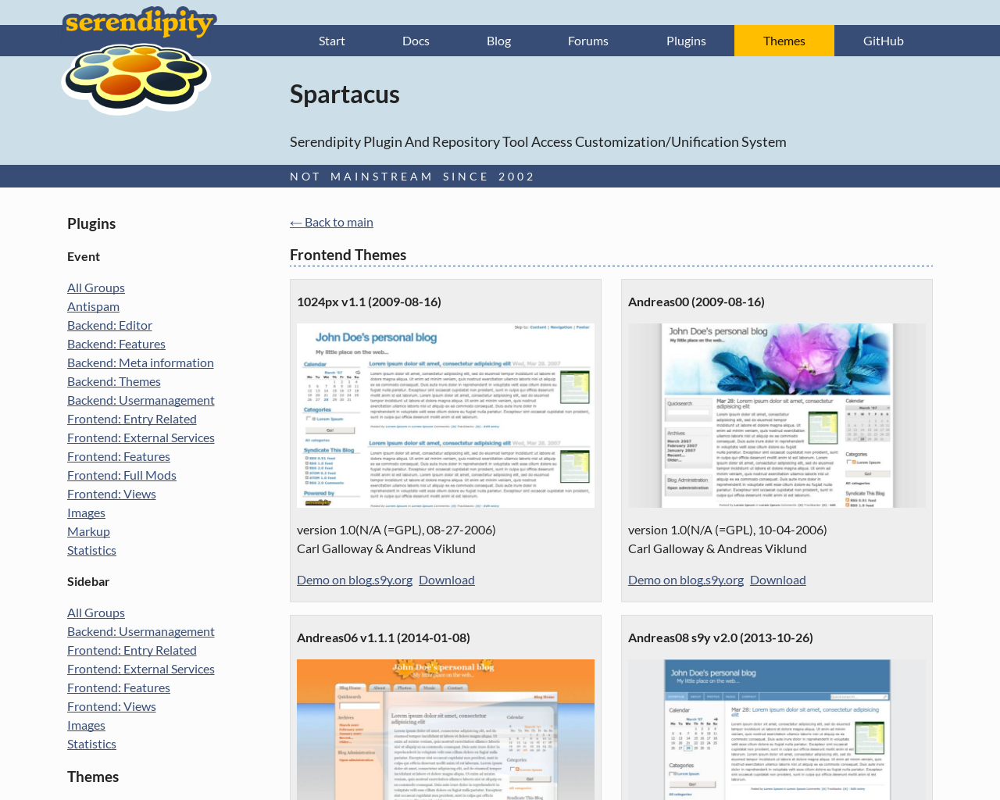
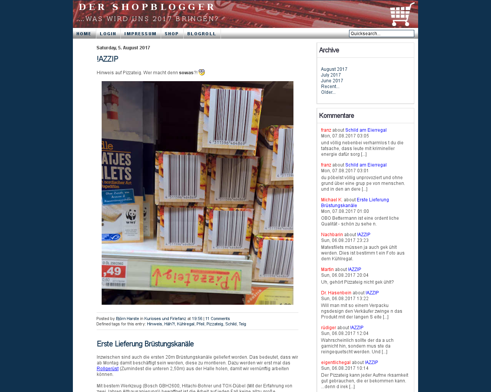
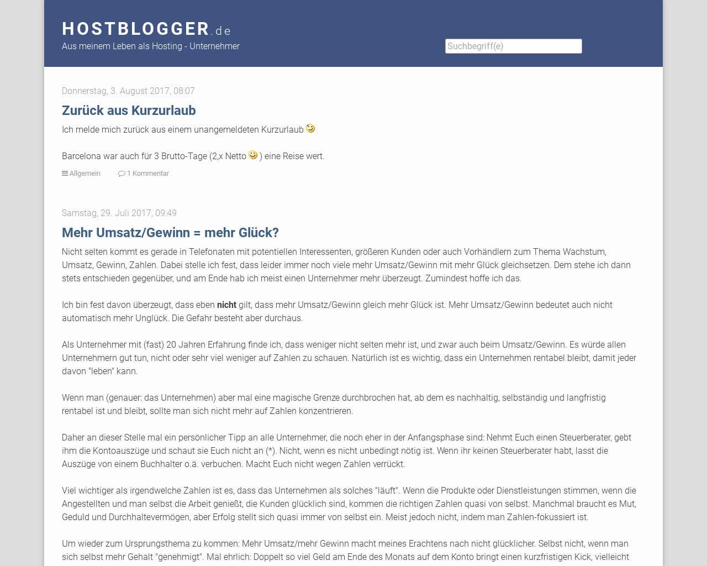
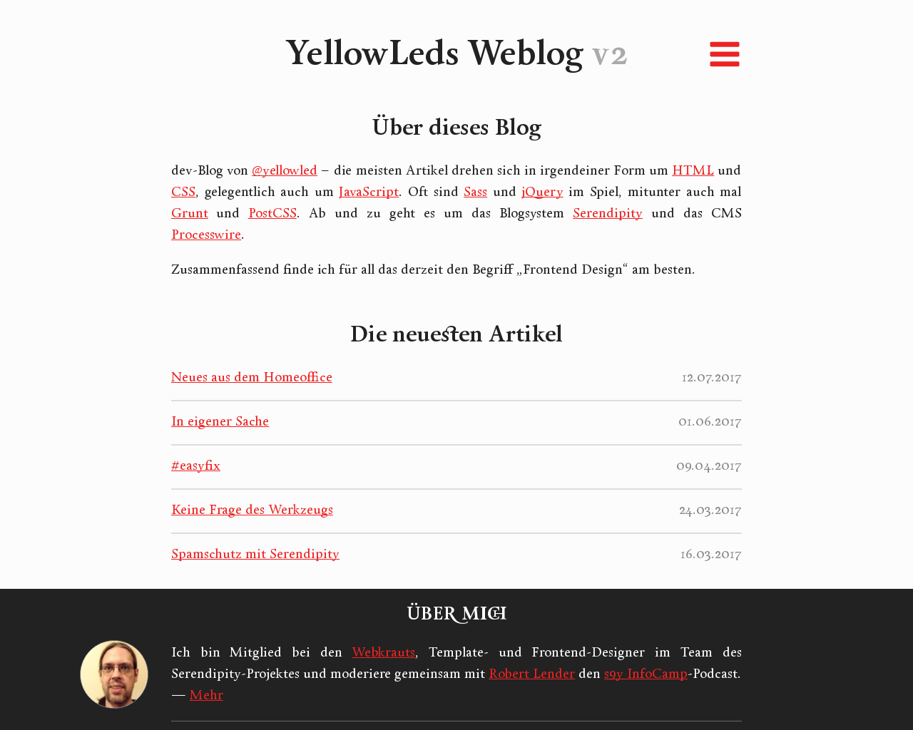
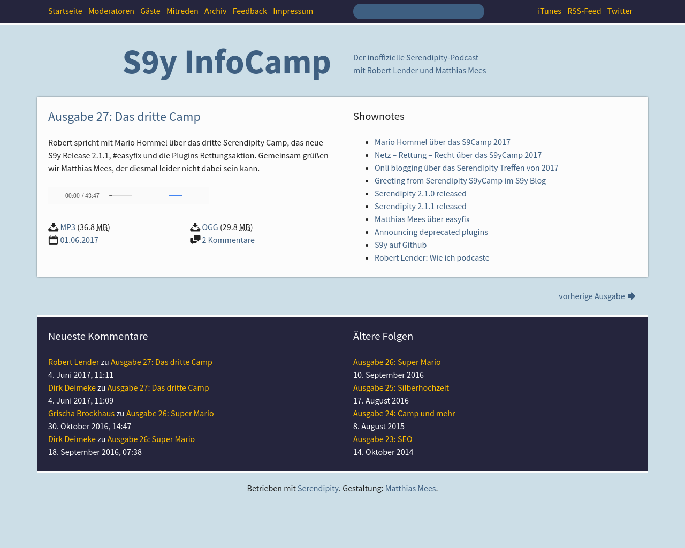
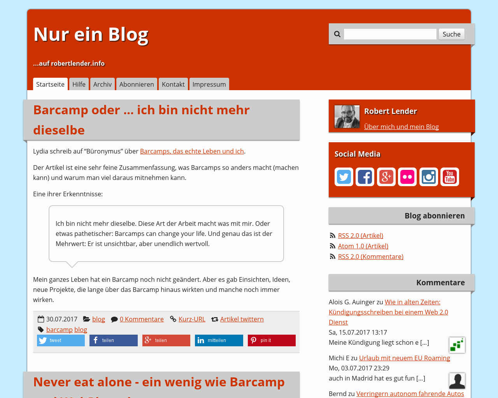
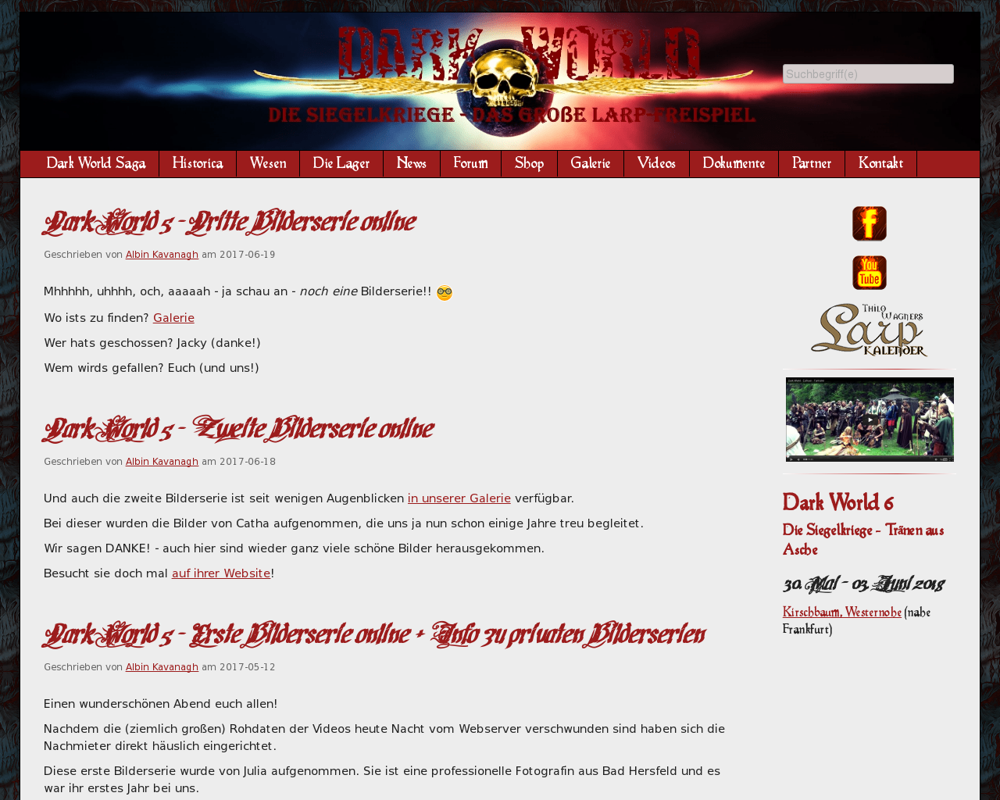

# Serendipity

Not mainstream since 2002.

---

## Hintergrund

+++

### Bedeutung Serendipity

Aus der Wikipedia zum Thema [Serendipität](https://de.wikipedia.org/wiki/Serendipit%C3%A4t)

> Der Begriff Serendipität (englisch serendipity), gelegentlich auch Serendipity-Prinzip oder Serendipitätsprinzip, bezeichnet eine zufällige Beobachtung von etwas ursprünglich nicht Gesuchtem, das sich als neue und überraschende Entdeckung erweist.

+++

### Ihr habt es nicht gesucht, aber gefunden :-)

Serendipity oder kurz s9y ist für die Dauer dieses Vortrags eine auf PHP basierende Software, mit der man ein Weblog betreiben kann.

Immer wenn jemand "der" Blog sagt, stirbt irgendwo ein Kätzchen ...

Ich weiss, dass der Duden "der" und "das" Blog erlaubt.

+++

### Geschichte

- Entwicklung seit 2002
- Version 1.0 in 2006
- Version 2.0 Ende 2015
- Aktuell Version 2.1.1

+++

### Philosophie

- s9y ist eine Blogsoftware und nichts anderes
- Ein Plugin pro Aufgabe
  - Ausnahme Antispam
- Langfristige Stabilität
- BSD Lizenz

+++

### s9y steht für

- Verlässlichkeit
- Sicherheit
- Erweiterbarkeit
- Benutzerfreundlichkeit

+++

### Stimme aus der Community

Hostblogger Manuel Schmitt:
> Da ich beruflich immer wieder mal mit WordPress zu tun habe, auch ein eindringlicher Tipp für alle, die ein reines Blog-System suchen: s9y ist um Welten einfacher zu bedienen und bietet, wenn man mal ehrlich ist, alles, was man für ein reines Blog braucht. Wer WordPress natürlich als CMS missbraucht, für den ist es natürlich nichts.

https://www.hostblogger.de/blog/archives/6792-S9Y-2.0-meine-Erfahrungen.html

+++

### Fun fact!

Rasmus Lerdorf - der Erfinder von PHP - nutzt auch Serendipity: https://toys.leerdorf.com

---

## Technisches

+++

### Installation

- PHP wenigstens in Version 5.6
- Datenbanken
  - MySQL/MariaDB bevorzugt
  - PostgreSQL
  - SQLite

+++

### Artikelformat

- WYSIWYG mit dem CKEditor
- Textile
- Markdown
- HTML

+++

### Plugins

- Seitenleisten-Plugins aka Widgets
- Ereignis-Plugins für alles andere

+++

### Spartacus

http://spartacus.s9y.org

Installiert Plugins direkt aus dem Netz.

[S]erendipity [P]lugin [A]ccess [R]epository [T]ool [A]nd [C]ustomization/[U]nification [S]ystem -

+++

### Themes

---

## Live-Demo

(Lokale virtuelle Maschine).

---

## Beispielblogs

+++

### Der Shopblogger

(knapp 20.000 Artikel)

http://www.shopblogger.de/blog/

+++

### Hostblogger.de

https://www.hostblogger.de/blog/

+++

### About s9y

https://abouts9y.org

+++

### YellowLeds Weblog v2

http://yellowled.de

+++

### s9y InfoCamp
(Podcast mit und über Serendipity)

https://www.s9ycamp.info

+++

https://www.robertlender.info/blog/

+++

### Dark World

http://dark-world.eu/s9y/

---

## Interaktion

+++

### Team

Kleines Team rund um Garvin Hicking als "Chefentwickler".

Überwiegend Muttersprache Deutsch (niedrige Einstiegshürde), Hauptsprache im Forum ist aber Englisch.

+++

### Entwicklung

GitHub - Pull Requests

- https://github.com/s9y/Serendipity
- https://github.com/s9y/additional_plugins
- https://github.com/s9y/additional_themes

+++

### Forum

https://board.s9y.org

+++

### s9y Camp

https://docs.s9y.org/camp.html

Meist im Frühjahr im Linuxhotel.

---

## Viel Spass beim Ausprobieren!

Dirk Deimeke - [d5e.org](https://d5e.org)
